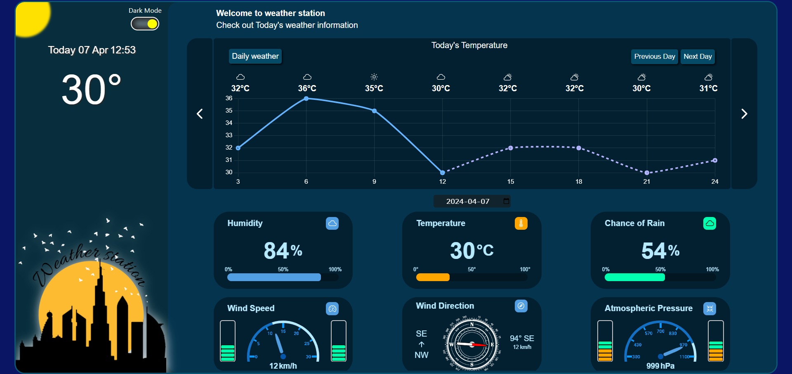
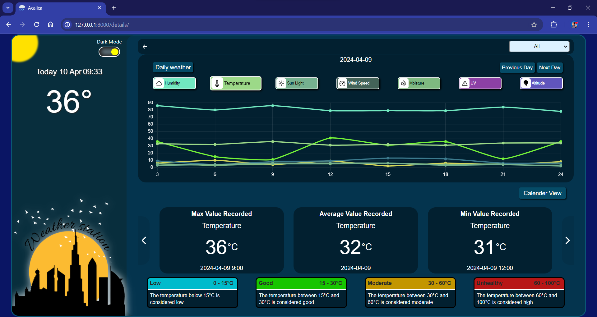
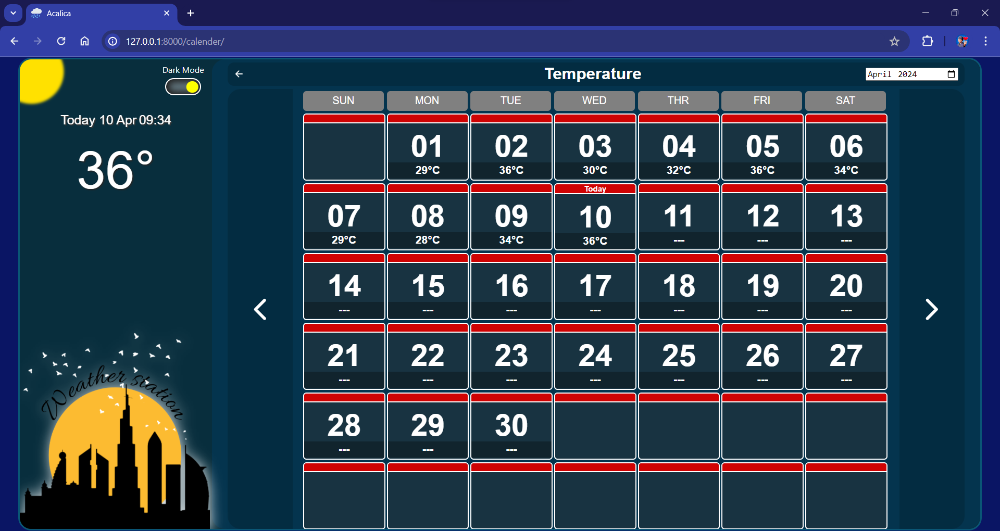

# 🌤️ Weather Station Using IoT, Django, and Jupyter Notebook

This project is an IoT-based weather monitoring system that integrates **Django** for backend development and **Jupyter Notebook** for data analysis and Prediction. It collects real-time weather data via IoT sensors, processes the information, and displays it through a user-friendly web interface.

---

## 📁 Repository Structure

- **Arduino Code/ NODEMCU (WIFI)/**  
  Contains the Arduino code for the NodeMCU (ESP8266) microcontroller to collect weather data from sensors.

- **Python/**  
  Includes Python scripts for data processing and analysis.

- **WeatherStation/**  
  Houses the Django project files for the web application.

- **acalica.sql**  
  SQL file for setting up the database schema.

- **Images/**  
  Contains images used in the web interface:
  - `Details.png`
  - `Home.png`
  - `Calender.png`

---

## 🔧 Setup Instructions

### Prerequisites

- Python 3.x
- Django
- Jupyter Notebook
- Arduino IDE

### Steps

1. **Clone the Repository**:
   ```bash
   git clone https://github.com/mrabhin03/Weather-Station-Using-IOT-Django-JupyterNotebook.git
   ```

2. **Set Up the Django Project**:
   ```bash
   cd WeatherStation
   pip install -r requirements.txt
   python manage.py migrate
   python manage.py runserver
   ```

3. **Upload Arduino Code**:
   Open the Arduino IDE, navigate to `Arduino Code/ NODEMCU (WIFI)/`, and upload the code to your NodeMCU device.

4. **Run Jupyter Notebook**:
   Navigate to the `Python/` directory and start the Jupyter Notebook to analyze and visualize the collected data.

---

## 📊 Features

- **Real-Time Data Collection**:  
  Gathers temperature, humidity, and other weather parameters using IoT sensors.

- **Web Interface**:  
  Displays the collected data through a Django-powered web application.

- **Data Analysis**:  
  Utilizes Jupyter Notebook for in-depth data analysis and visualization.

---

## 📷 Screenshots

**Home Page**:  


**Details Page**:  


**Calendar View**:  


---

## 📄 License

This project is licensed under the MIT License.

---

## Packages Needed
  - `pip install django`
  - `pip install django mysqlclient`
  - `pip install django-extensions`
  - `pip install joblib`
  - `pip install numpy`
  - `pip install pandas`
  - `pip install scikit-learn`

---

> For more information, visit the [GitHub Repository](https://github.com/mrabhin03/Weather-Station-Using-IOT-Django-JupyterNotebook).
